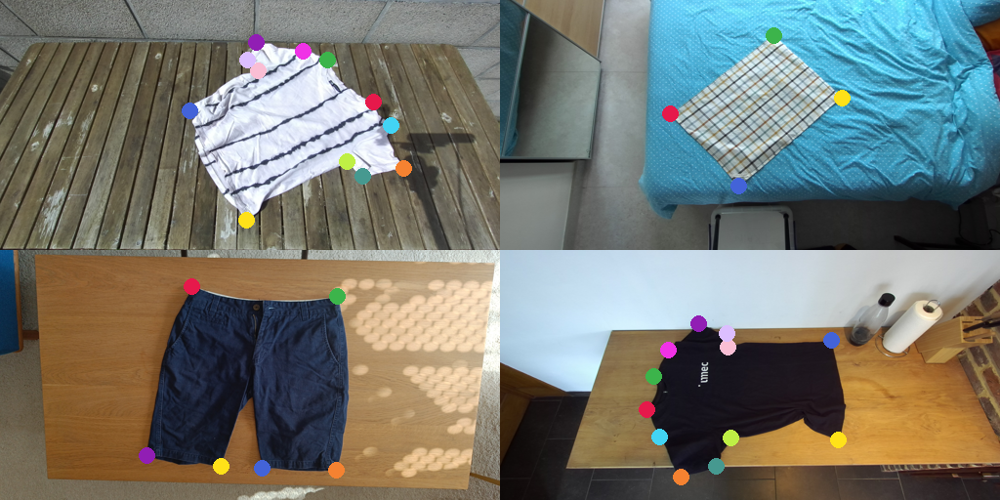
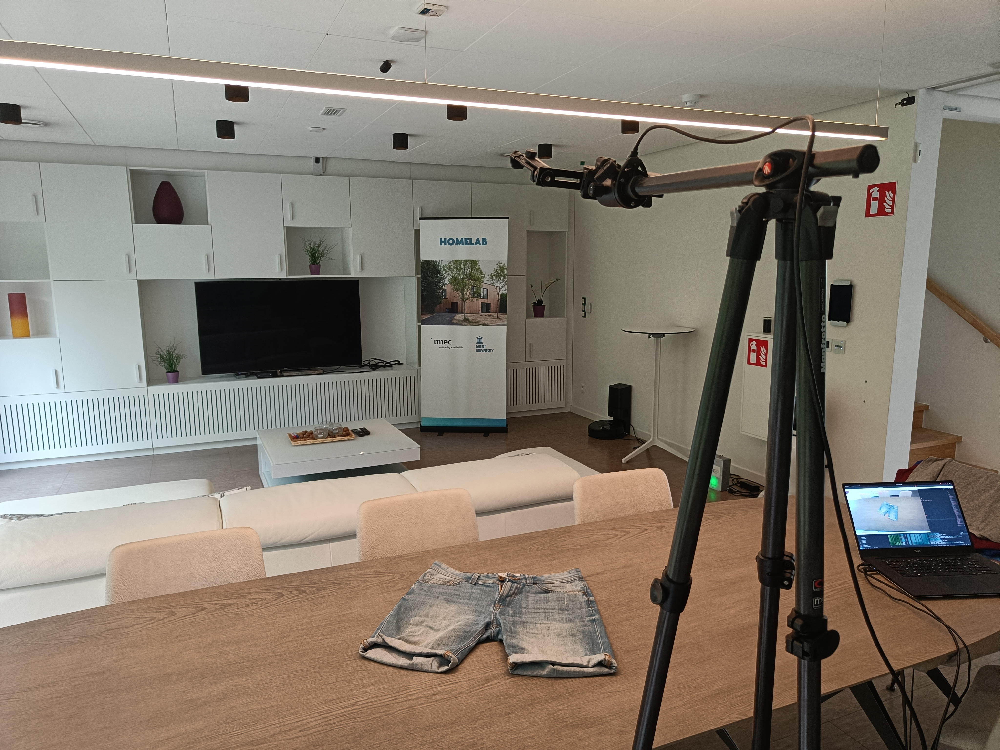

# aRTF Clothes
The aRTF (almost-ready-to-fold) Clothes dataset contains around 2000 images of various clothing items across 4 categories, in a variety of realistic (where a human/robot might do laundry folding) household settings.

The almost-ready-to-fold part refers to the states of the clothes. We mimick the output of current SOTA robotic unfolding pipelines, which are capable but not yet perfect.

The aim of this dataset is to evaluate perception modules on a variety of cloth pieces for each category in a number of realistic environments. We hope this will help bring robots out of the labs into our everyday living environments.

Category| # Scenes| | # Cloth items| | #images| |
---|---|---|---|---|---|---|
. | train | test | train | test | train | test
Tshirt  | 6 |8 |  15| 20 | 210 | 400
Towel  | 6 |8 |  15| 20 | 210 | 400
Shorts | 6 | 8 | 8 | 9 | 112 | 180
Boxershorts | 6 | 8 | 11 | 11 | 154 | 220
Total |  6 | 8 | 49 |60 | 686 | 1200

## Using this dataset

You can get the full RGB dataset with COCO-formatted annotations [here](https://cloud.ilabt.imec.be/index.php/s/ezqASWNLmEEcocQ/download/aRTFClothes-rgb.zip) (7GB).

The resized splits used in the paper associated with the dataset can be found [here](https://cloud.ilabt.imec.be/index.php/apps/files/?dir=/Datasets/RTFClothes/synthetic-cloth-paper&fileid=1150006524).

----
## Dataset Creation

### Data capturing
We used a Zed2i camera and smartphone. Example scene is given below:

### Labeling
CVAT was used for labeling. We set up CVAT locally and also used the serverless components to enable Segment-Anything, which we used for labeling segmentation masks of all cloth items. Keypoints were all manually labeled.

The semantic keypoints we have labeled are illustrated below:
TODO: template + semantic labels for each category.

### Dataset Post-processing
Make sure to download  he dataset to the `data` folder in this repo first.

#### Local installation (required to run the postprocessing steps)

- clone this repo (with submodules)
- create the conda environment `conda env create -f environment.yaml`
-(initialize the pre-commit hooks `pre-commit install`)

#### Obtaining desired dataset formats

To create COCO keypoints datasets, we use the `airo-dataset-tools` package and perform following steps:

1. Export the dataset annotations from cvat in their image format and save the file in the parent directory of the dataset images
2. create a coco categories file that describes the semantic classes, using the `scripts/create_coco_categories.py` script.

2. Convert the cvat file to COCO format using `airo-dataset-tools convert-cvat-to-coco-keypoints --coco_categories <coco-categories-file> --add_segmentation  <path-to-cvat-xml> `
3. (if needed) change the relative base of the image paths to match your coco dataset structure.
4. inspect the dataset and annotations with Fiftyone to make sure all looks fine: `airo-dataset-tools fiftyone-coco-viewer <path-to-coco-json> -l keypoints -l segmentations -l detections`

5. (TODO) convert to YOLO formats.

A number of steps are bundled in [this](artf_clothes/scripts/create_coco_dataset.py) script.

#### Resizing
To facilite rapid iterations, you can resize the images: `airo-dataset-tools resize-coco-keypoints-dataset --width 256 --height 256 <path-to-coco-json>`

